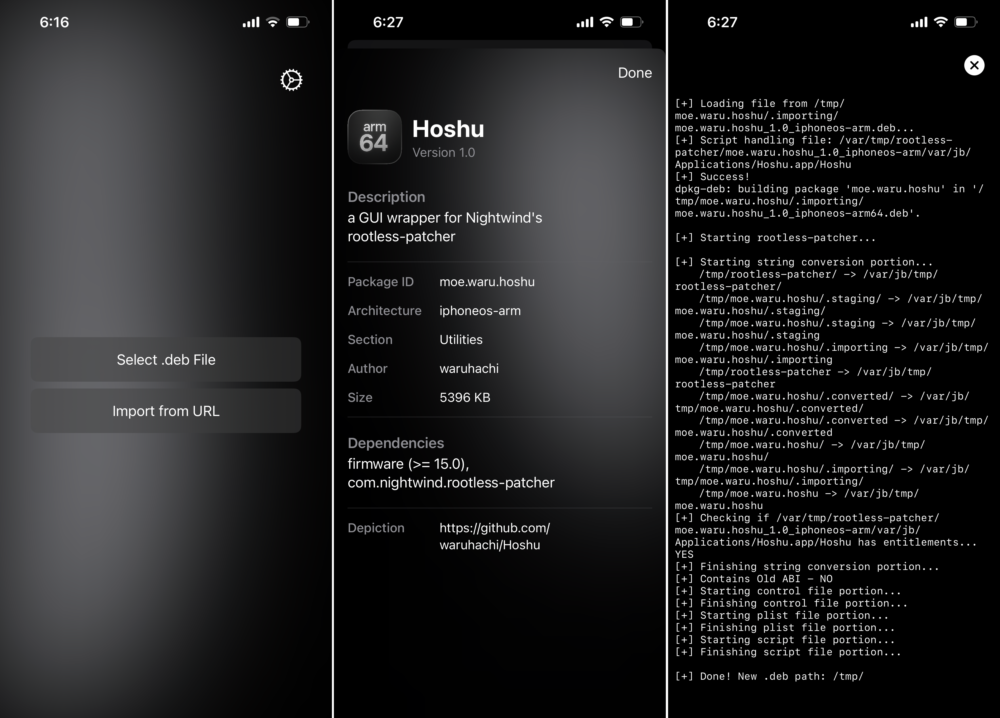

<h1 align="center">
  
  
  
  
</h1>

<br />
<div align="center">
  
  <h3 align="center">Hoshu</h3>

  <p align="center">
    Convert .deb packages for rootless workflows on iOS with a clean SwiftUI interface.
  </p>
</div>

<div align="center">
  
</div>

## About The Project

Hoshu is an iOS utility focused on converting `.deb` packages, especially for rootless jailbreak workflows.

The app supports importing packages from local files or URL, parsing metadata from [`DEBIAN/control`](layout/DEBIAN/control), running conversion through [`rootless-patcher`](https://github.com/NightwindDev/rootless-patcher), and sharing results directly to popular package manager apps.

### Features

- Import `.deb` files from:
  - Native iOS file picker
  - Alternative in-app file picker
  - Direct URL download
- Parse and display package metadata from [`DEBIAN/control`](layout/DEBIAN/control)
- Detect likely rootless packages and show a confirmation alert
- Convert packages using [`rootless-patcher`](https://github.com/NightwindDev/rootless-patcher)
- Share output directly to:
  - Sileo (`org.coolstar.SileoStore`)
  - Zebra (`xyz.willy.Zebra`)
  - Filza (`com.tigisoftware.Filza`)
  - System share sheet
- Built-in cache/temp cleanup from `Settings`

## Getting Started

### Prerequisites

- [macOS](https://www.apple.com/macos/) with [Xcode](https://developer.apple.com/xcode/) installed
- [Theos](https://theos.dev) toolchain configured
- [iOS](https://www.apple.com/ios/) target that matches your jailbreak/deployment setup
- Have [`rootless-patcher`](https://github.com/NightwindDev/rootless-patcher) installed

### Dependencies

Resolved via [Swift Package Manager](https://www.swift.org/package-manager/) (`Hoshu.xcodeproj`):

- [`AuxiliaryExecute` v2.1.0](https://github.com/Lakr233/AuxiliaryExecute)
- [`FluidGradient` v1.0.0](https://github.com/Cindori/FluidGradient)

### Build & Package

This project is configured as an [Xcode](https://developer.apple.com/xcode/)-backed [Theos](https://theos.dev) package.

```bash
make clean package
```

Key configuration in [`Makefile`](Makefile):

- `XCODEPROJ_NAME = Hoshu`
- `XCODE_SCHEME = Hoshu`
- `$(XCODEPROJ_NAME)_INSTALL_PATH = /Applications`
- `IPHONEOS_DEPLOYMENT_TARGET = 15.0`

After install, the app is opened with bundle id `moe.waru.hoshu`.

## License

Distributed under the [GNU GPL v3.0](LICENSE).
